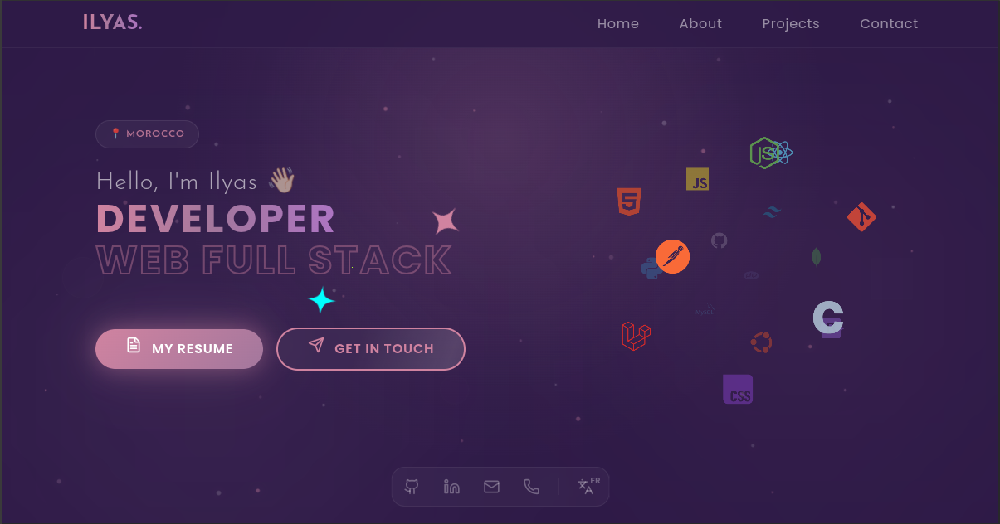

<div align="center">

# 🛡️ Ilyas Lhouari — Developer Portfolio

**A Full-Stack Developer Portfolio**

[](https://react.dev/)
[](https://vite.dev/)
[](https://tailwindcss.com/)
[](https://www.framer.com/motion/)
[](https://www.i18next.com/)

<br/>



<br/>

_A premium, dark-themed personal portfolio built with a cyber aesthetic, glassmorphism effects, animated particle fields, and full internationalization — engineered by a developer who puts security first._

[**🌐 Live Demo**](https://ilyaslhouari.netlify.app/) · [**📄 Resume**](https://ilyaslhouari.netlify.app/Ilyas_Resume.pdf)

</div>

---

## 📖 Description

Welcome to my personal developer portfolio! I am **Ilyas Lhouari**, a Junior **Full-Stack Web Developer** with a deep passion for **cybersecurity** and a **"Security-First"** engineering mindset. Trained in the intensive, peer-to-peer environment of **1337 Coding School (42 Network)**, I built this space to showcase a curated collection of my production-grade projects — from SaaS platforms with multi-tenant architecture to serverless e-commerce solutions.

I designed this site to leave a lasting impression: a deep midnight eggplant color palette, volumetric glow effects, animated particle fields, and glassmorphic UI panels create a futuristic, premium experience. Every component is fully responsive, accessible in both **English** and **French**, and powered by performant, modern tooling.

---

## ✨ Features

| Category | Details |
|:---|:---|
| 🎨 **Glassmorphism UI** | Frosted-glass panels with `backdrop-filter: blur()`, subtle borders, and volumetric glow shadows across all sections |
| 🌍 **Internationalization (i18n)** | Full English 🇬🇧 & French 🇫🇷 support via `react-i18next` with automatic browser language detection |
| 📱 **Fully Responsive** | Mobile-first layout with adaptive grid systems, responsive typography, and touch-friendly interactions |
| ✉️ **Secure Contact Form** | Client-side form integrated with **EmailJS** — no backend server required. Environment variables keep API keys safe |
| 🎞️ **Framer Motion Animations** | Smooth page transitions, scroll-triggered reveals, and micro-interactions powered by Framer Motion |
| 🌌 **Animated Particle Field** | Canvas-based ambient particle system with drift, orbit, and shimmer animations for depth |
| ☁️ **3D Icon Cloud** | Interactive, rotating technology icon sphere showcasing my skill set |
| 🔮 **Parallax Tilt Effects** | Profile image with 3D parallax tilt on hover via `react-parallax-tilt` |
| ✨ **Sparkles Component** | Decorative sparkle overlay effects on hero titles and section headings |
| 🚢 **macOS-Style Dock** | Floating bottom navigation dock with magnification effect and language switcher |
| ⏳ **Animated Preloader** | Branded loading screen with smooth transition into the main content |
| 🔔 **Toast Notifications** | User feedback for form submissions via `react-hot-toast` |
| 🔍 **SEO Optimized** | Open Graph, Twitter Card meta tags, structured heading hierarchy, and semantic HTML |
| ⚡ **Lightning-Fast Builds** | Vite 7 with HMR for instant dev feedback and optimized production bundles |

---

## 🛠️ Tech Stack

### Core

| Technology | Purpose |
|:---|:---|
| [React 19](https://react.dev/) | Component-based UI library |
| [Vite 7](https://vite.dev/) | Next-gen frontend build tool with HMR |
| [Tailwind CSS 4](https://tailwindcss.com/) | Utility-first CSS framework (v4 engine with `@theme` directives) |

### UI & Animation

| Technology | Purpose |
|:---|:---|
| [Framer Motion](https://www.framer.com/motion/) | Declarative animations & transitions |
| [Lucide React](https://lucide.dev/) | Modern, clean SVG icon library |
| [React Icons](https://react-icons.github.io/react-icons/) | Extended icon sets |
| [React Parallax Tilt](https://github.com/mkosir/react-parallax-tilt) | 3D tilt hover effects |
| [React Icon Cloud](https://github.com/bkrem/react-icon-cloud) | Interactive 3D icon sphere |

### Internationalization

| Technology | Purpose |
|:---|:---|
| [i18next](https://www.i18next.com/) | i18n framework core |
| [react-i18next](https://react.i18next.com/) | React bindings for i18next |
| [i18next-browser-languagedetector](https://github.com/i18next/i18next-browser-languageDetector) | Auto-detects user language from browser |

### Services & Utilities

| Technology | Purpose |
|:---|:---|
| [EmailJS](https://www.emailjs.com/) | Serverless email delivery for the contact form |
| [React Hot Toast](https://react-hot-toast.com/) | Lightweight toast notification system |
| [UUID](https://github.com/uuidjs/uuid) | Unique identifier generation |

### Developer Tooling

| Technology | Purpose |
|:---|:---|
| [ESLint 9](https://eslint.org/) | Code linting with React Hooks & Refresh plugins |
| [GitHub Actions](https://github.com/features/actions) | CI/CD workflow automation |

---

## 🚀 Getting Started

### Prerequisites

- **Node.js** ≥ 18.x
- **npm** ≥ 9.x (or yarn / pnpm)
- An [EmailJS](https://www.emailjs.com/) account (free tier available)

### 1. Clone the repository

```bash
git clone https://github.com/lilyaaas/portfolio.git
cd portfolio
```

### 2. Install dependencies

```bash
npm install
```

### 3. Configure environment variables

Create a `.env` file in the project root:

```env
VITE_EMAILJS_SERVICE_ID=your_service_id
VITE_EMAILJS_TEMPLATE_ID=your_template_id
VITE_EMAILJS_PUBLIC_KEY=your_public_key
```

> [!NOTE]
> You can obtain these values from your [EmailJS Dashboard](https://dashboard.emailjs.com/). The `VITE_` prefix is required for Vite to expose them to the client bundle.

### 4. Start the development server

```bash
npm run dev
```

The app will be available at `http://localhost:5173`.

### 5. Build for production

```bash
npm run build
npm run preview   # Preview the production build locally
```

---

## 📁 Folder Structure

```
src/
├── assets/
│   ├── Certificates/          # Certificate images
│   └── Projects/              # Project screenshot images
│       ├── clickshop.png
│       ├── devis-hub.png
│       ├── food-api.png
│       ├── movie.png
│       └── portfolio.png
├── components/
│   ├── Dock/
│   │   ├── Dock.jsx           # macOS-style floating dock navigation
│   │   └── LanguageSwitcher.jsx  # EN/FR language toggle
│   ├── header/
│   │   └── Header.jsx         # Top navigation bar
│   ├── loading/
│   │   └── Preloader.jsx      # Animated loading screen
│   └── ui/
│       ├── IconCloud.jsx      # 3D rotating icon sphere
│       ├── ParticleField.jsx  # Ambient particle animation layer
│       └── Sparkles.jsx       # Decorative sparkle overlay
├── locales/
│   ├── en.json                # English translations
│   └── fr.json                # French translations
├── pages/
│   ├── Home.jsx               # Hero section with CTA
│   ├── About.jsx              # Bio & profile image
│   ├── Projects.jsx           # Project showcase grid
│   ├── contact.jsx            # Contact form (EmailJS)
│   └── Footer.jsx             # Footer with copyright
├── style/
│   └── main.css               # Global styles, @theme config, keyframes
├── App.jsx                    # Root component & layout
├── i18n.js                    # i18next configuration
└── main.jsx                   # App entry point
```

---

## 📜 Available Scripts

| Command | Description |
|:---|:---|
| `npm run dev` | Start Vite dev server with HMR |
| `npm run build` | Create optimized production build |
| `npm run preview` | Locally preview the production build |
| `npm run lint` | Run ESLint across the codebase |

---

## 🌐 Deployment

This portfolio is deployed on [**Netlify**](https://www.netlify.com/). To deploy your own instance:

1. Push your code to a GitHub repository.
2. Connect the repo to Netlify.
3. Set the **build command** to `npm run build` and **publish directory** to `dist`.
4. Add the `VITE_EMAILJS_*` environment variables in Netlify's dashboard under **Site settings → Environment variables**.

---

<div align="center">

### Built with 💜 by **Ilyas Lhouari**


[](https://www.linkedin.com/in/ilyas-lhouari/)
[](https://github.com/lilyaaas)
[](https://ilyaslhouari.netlify.app/)

</div>
